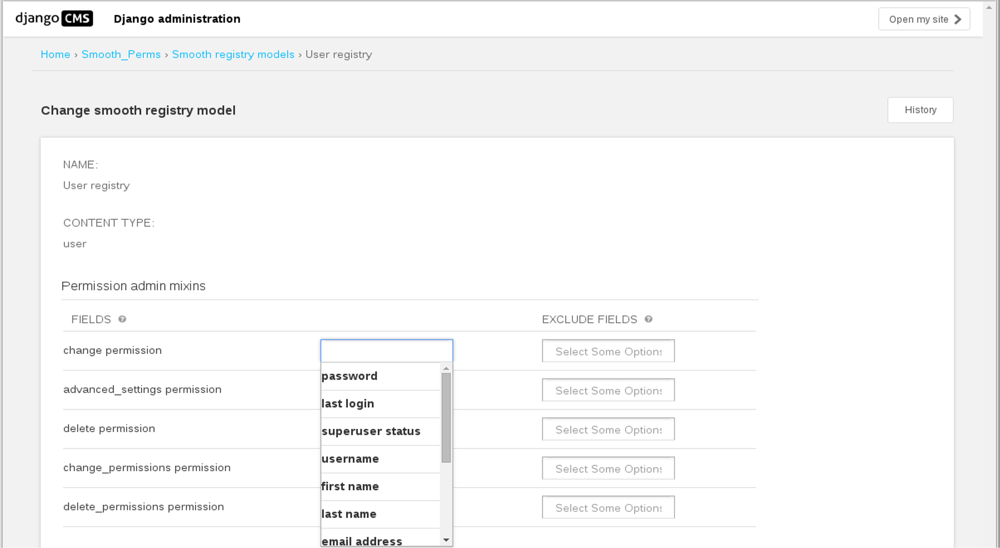
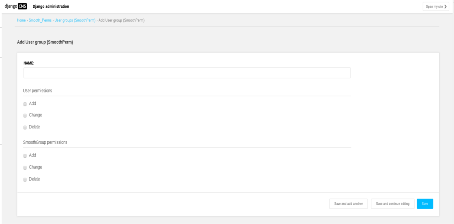

Smooth Registry
===============

At this step, you have your model and admin configure. Now you need to set the
 behaviour for all the couple permissions/fields for each model.

For this you need to use smooth_registry. You can found him here ``from smooth_perms.utils.registry import smooth_registry``.

Register model
--------------

You can add all your model in the registry (not only ModelPermission Model).
For add a model ::

    smooth_registry.register(MyModel, "text to show")

.. note:: The second parameter is optionnal

.. note:: By default, the second parameter equal to ``_(u'{} permissions') .format(model.__name__)``

.. note:: Each model you register are add in smooth_group design.

Modify fields permissions
-------------------------

You can modify fields permissions in admin with model ``Smooth registry models``

.. important:: All objects in ``Smooth registry models`` are automatically generated using ``smooth_registry``

Like see on image, for each permission you define fields are readonly/exclude if user doesn't have permission.

Smooth group
------------

Smooth group model use the basic group system provide by Django, with an interface more user friendly.

